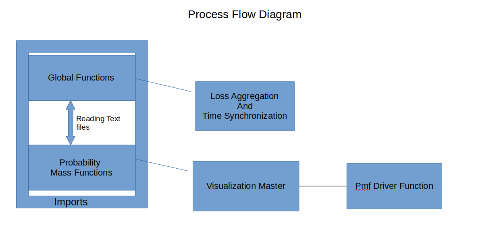

# PacketLossAnalysis-Loss Aggregation, Time Sync and Probability Mass Functions

Packet loss Analysis is used for Identifying patterns in frame loss across receivers.
Time Synchronization is done synchronize all received frames with a global time stamp,
so that we can compute the recevier delay which is the the difference betweeen a frame received 
at one receiver wrt to the same frame received in other  receivers.

# Process Flow Diagram:

# Repo contents:
This repository has three main driver functions:
1) loss_aggregation.py
2) time_sync_main
3) pmf_main_driver
#Loss Aggregation
Loss aggregation is done  to "aggregate" frame loss across receivers.
What this essentially means is that we assign a unique value in the raneg of 1-16
for a receiver combination. For example if all the receivers get a particular frame,
the value '1' is assigned. Essentially since there are four recv in the experimental setup and each recv can either
get a frame or not get a we get 2^4 =16 values

#Probabilty Mass Function:
Pmf is a great measure for statistical analysis. We use Pmf to identify patterns in loss burst len and interval
.This is done at Run level and a receiver level 
# Imports and Global declarations:
Since this repo has three major functionalities (Pmf,TimeSync,Loss Aggregation ) imports are divided accordingly
1) global_functions-> contains all the logic for time_sync,loss_aggregation,Counting Number Of Runs and File Read
2) probability_mass_function->has all the info for pmf calculations and recv_loss combination
3) Vizualization_master-> function decelerations for plottign vizaulization. We do this because often times we 
work with Multiple Data Rate so it makes sense to repoint the location of text file and proceed with the analysis
# Text file location:
1) While running the function please keep all your text files in a dicrectory called files.
2) Any changes made file name or path should be made in the respective driver functions.
3) Any changes to parser logic, needs to made in **file_read()** function in **global_function.py and time_sync_driver.py**
!!! Important : while doing Pmf analysis, if the location, name of the text file is channged then the same change must be reflected in
getcount.py
4) It is better to follow the same naming conventions used for frewer modifications in scripts

    

